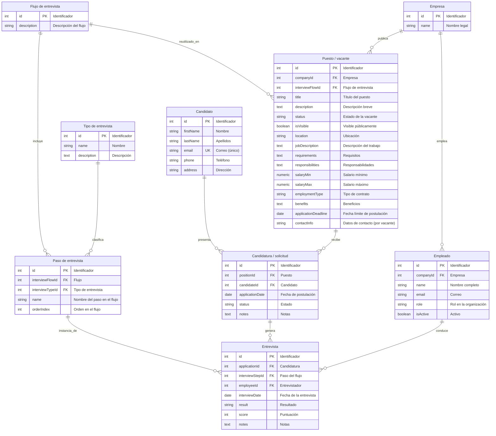

# Modelo entidad-relación (ERD)

## Notas sobre cardinalidades

- **Position → InterviewFlow**: varias vacantes pueden compartir el mismo flujo. *Ejemplo:* las ofertas «Desarrollador backend (Madrid)», «Desarrollador backend (remoto)» y «Tech lead backend» reutilizan el mismo flujo «Estándar ingeniería — 3 fases»; cada oferta sigue apuntando a **un** `interviewFlowId`, pero ese flujo no es exclusivo de una sola oferta.
- **InterviewStep → InterviewType**: varios pasos pueden reutilizar el mismo tipo. *Ejemplo:* en un flujo, el paso 1 se llama «Screening con RRHH» y el paso 4 «Seguimiento telefónico»; ambos pueden ser de tipo **«Llamada»** (`interviewTypeId` repetido); otro flujo distinto puede volver a usar el tipo «Llamada» en otros pasos.
- **Interview → InterviewStep**: muchas entrevistas concretas referencian la misma definición de paso. *Ejemplo:* cincuenta candidaturas distintas generan cincuenta filas en `Interview`, pero todas referencian el mismo `interviewStepId` del paso «Entrevista técnica — panel» definido en el flujo de esa vacante.
- **Entrevista → paso (regla de negocio)**: cada entrevista concreta corresponde a **un** paso del flujo asignado a la vacante de esa candidatura. *Ejemplo:* la candidatura de Ana a la oferta «Backend senior» usa el flujo F; la entrevista del 12/05 debe enlazar un paso que pertenezca a F (p. ej. «Técnica con el equipo X»), no un paso definido en el flujo de otra oferta u otra empresa.

## Notas sobre normalización

La descripción corporativa para candidatos se obtiene de **Company**; no se modela texto duplicado en la vacante. **`contactInfo`** describe datos de contacto **propios de la publicación** (p. ej. canal o persona para esa posición). El **`name`** de **InterviewStep** es el rótulo del paso en ese flujo (p. ej. «Entrevista técnica con el equipo X»), no una copia del nombre del tipo de entrevista.

## Convenciones alineadas con `schema.prisma`

- **Entidades**: mismos identificadores que los `model` (PascalCase).
- **Campos**: camelCase; restricción **única** en `Candidate.email` como `UK`, equivalente a `@unique` en Prisma.
- **Fechas solo con parte de día**: en el ERD se documentan como `date`; en Prisma se modelan como `DateTime` (mapeo físico, p. ej. tipo fecha en PostgreSQL cuando aplique).

